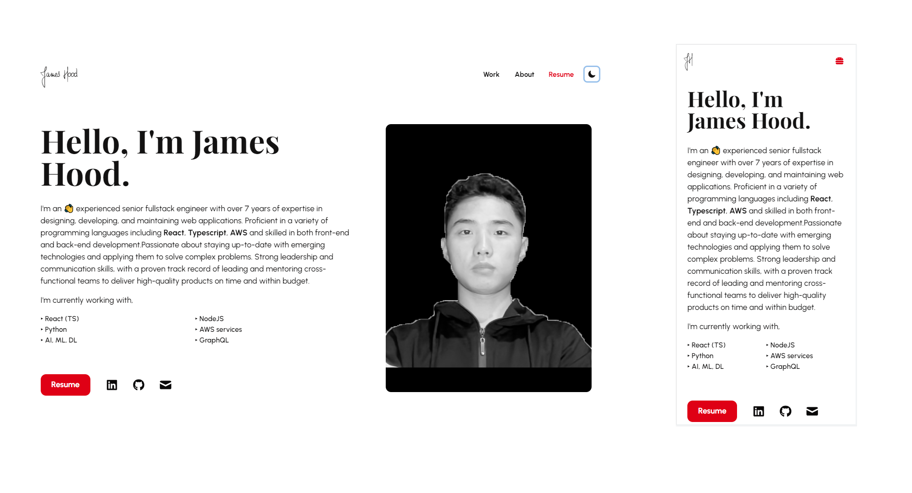

# Portfolio Template 🖐

> Version 2 of a simple, minimal and responsive personal website template, built using React, TypeScript, HTML and SCSS.



---

## Table of Contents

-   [Installation](#installation)
-   [Usage](#usage)
-   [Contributing](#contributing)
-   [Connect](#connect)
-   [License](#license)

---

## Installation

### Setup

Close repository

```shell
$ git clone https://github.com/peaceeng/personal-portfolio.git
```

To install the node packages used in the project:

```shell
$ cd personal-portfolio
$ yarn install
```

Compiles and hot-reloads for development

```shell
$ yarn start
```

Compiles and minifies for production

```shell
$ yarn build
```

## Usage

All the information can be edited in the JSONs and Markdowns in the [content folder](https://github.com/peaceeng/personal-portfolio/tree/main/src/content). Each section of the portfolio has its own folder. The `common.json` file contains details that are used throughout the website.

All the images are in `public/assets`.

## Contributing

-   Clone this repo to your local machine.
-   Checkout to a new branch. Give it a relevant name!
-   Create a pull request

## License

-   **[MIT license](http://opensource.org/licenses/mit-license.php)**
-   Copyright 2022 © James Hood
